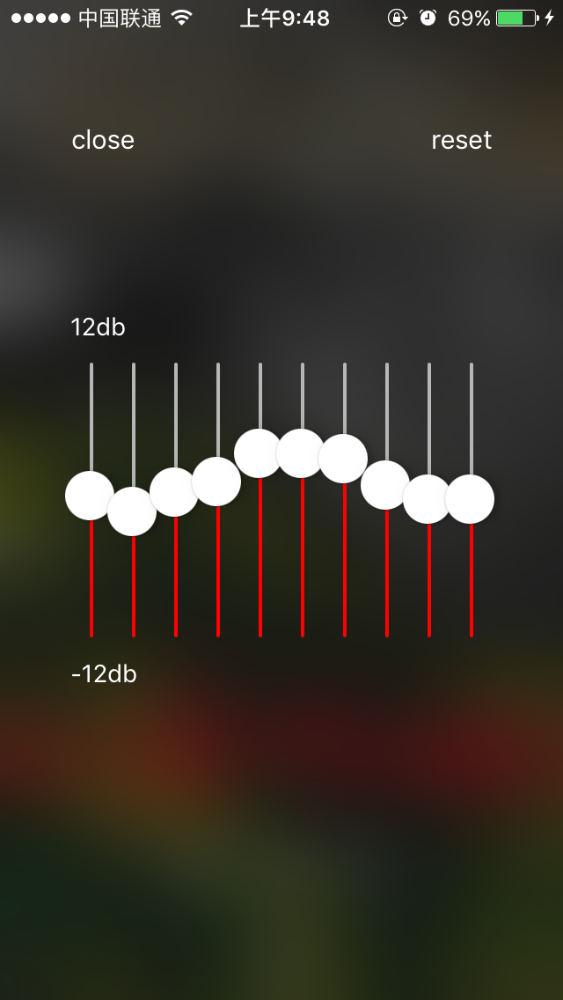
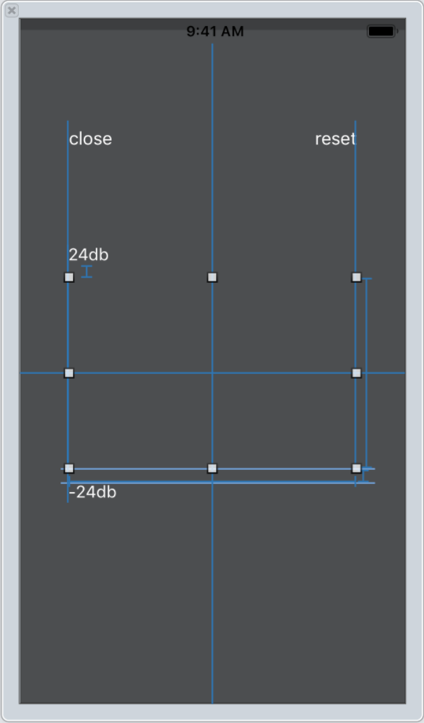

常见的均衡器都是分为十段的，其他更多分段的操作起来不会很顺手。所以以十段均衡器为例。



前几节中，MyAudioPlayer里面接入了一个AVAudioUnitEQ但没有设置相关属性，默认它是不工作的，因此需要做一些事。

先看看AVAudioUnitEQ里面有什么：

```
/*! @class AVAudioUnitEQ
    @abstract An AVAudioUnitEffect that implements a Multi-Band Equalizer.
 
*/

@interface AVAudioUnitEQ : AVAudioUnitEffect

/*! @method initWithNumberOfBands:
    @abstract Initialize the EQ with number of bands.
    @param numberOfBands
        The number of bands created by the EQ.
*/
- (instancetype)initWithNumberOfBands:(NSUInteger)numberOfBands;

/*! @property bands
    @abstract Array of AVAudioUnitEQFilterParameters objects.
    @discussion
        The number of elements in the array is equal to the number of bands.
*/
@property (nonatomic, readonly) NSArray<AVAudioUnitEQFilterParameters *> *bands;

/*! @property globalGain
    @abstract Overall gain adjustment applied to the signal.
    @discussion
        Range:     -96 -> 24
        Default:   0
        Unit:      dB
*/
@property (nonatomic) float globalGain;

@end

```

假设我们要分10段，直接用`- (instancetype)initWithNumberOfBands:(NSUInteger)numberOfBands`即可。然后还有一个AVAudioUnitEQFilterParameters数组对应了每一个分段。

```
/*! @class AVAudioUnitEQFilterParameters
    @abstract Filter parameters used by AVAudioUnitEQ.
    @discussion
        A standalone instance of AVAudioUnitEQFilterParameters cannot be created. Only an instance
        vended out by a source object (e.g. AVAudioUnitEQ) can be used.
*/
@interface AVAudioUnitEQFilterParameters : NSObject 
- (instancetype)init NS_UNAVAILABLE;

/*! @property filterType
    @abstract AVAudioUnitEQFilterType
    @discussion
    Default:    AVAudioUnitEQFilterTypeParametric
*/
@property (nonatomic) AVAudioUnitEQFilterType filterType;

/*! @property frequency
    @abstract Frequency in Hertz.
    @discussion
    Range:      20 -> (SampleRate/2)
    Unit:       Hertz
*/
@property (nonatomic) float frequency;

/*! @property bandwidth
    @abstract Bandwidth in octaves.
    @discussion
    Range:      0.05 -> 5.0
    Unit:       Octaves
*/
@property (nonatomic) float bandwidth;

/*! @property gain
    @abstract Gain in dB.
    @discussion
    Range:      -96 -> 24
    Default:    0
    Unit:       dB
*/
@property (nonatomic) float gain;

/*! @property bypass
    @abstract bypass state of band.
    @discussion
    Default:    YES
*/
@property (nonatomic) BOOL bypass;

@end
```
这些AVAudioUnitEQFilterParameters对象主要要用的属性有frequency、gain、bypass。
其中bypass默认YES的，也就是让信号直接通过而不处理，因此需要设为NO才能呈现效果。
然后遍历每一个frequency发现依次是40、57、83、120、174、251、264、526、5414、10000，和主流的32、64、125、250、500、1k、2k、4k、8k、16k不一致，也要改。

```
        self.audioEQ = [[AVAudioUnitEQ alloc] initWithNumberOfBands:10];
        NSArray *bands = self.audioEQ.bands;
        NSInteger bandsCount = bands.count;
        NSInteger maxFre = 16000;
        // api默认的10分段是40、57、83、120、174、251、264、526、5414、10000，应该要改掉
        // 假设是10段，那么市面上的频率分段为32、64、125、250、500、1k、2k、4k、8k、16k
        for (NSInteger i = bandsCount - 1; i >= 0; i --) {
            AVAudioUnitEQFilterParameters *ban = [bands objectAtIndex:i];
            ban.bypass = NO;
            ban.frequency = maxFre;
            maxFre /= 2;
        }
```

我认为均衡器数值变化用通知接收比较好，在MyAudioPlayer中添加一个通知处理：
```
[[NSNotificationCenter defaultCenter] addObserver:self selector:@selector(eqDidChangedNotification:) name:kEQChangedNotificationName object:nil];

- (void)eqDidChangedNotification:(NSNotification *)notification {
    NSArray *bands = [self.audioEQ.bands sortedArrayUsingComparator:^NSComparisonResult(AVAudioUnitEQFilterParameters *obj1, AVAudioUnitEQFilterParameters *obj2) {
        if (obj1.frequency > obj2.frequency) {
            return NSOrderedDescending;
        }
        return NSOrderedAscending;
    }];  // 这里根据频率排序，避免设置错误。
    NSInteger bandsCount = bands.count;
    for (NSInteger i = 0; i < bandsCount; i ++) {
        AVAudioUnitEQFilterParameters *ban = [bands objectAtIndex:i];
//        NSLog(@"%f", ban.frequency);
        CGFloat gainValue = [[[NSUserDefaults standardUserDefaults] valueForKey:[NSString stringWithFormat:@"%@%d", kEQBandKeyPrefix, (int)i]] floatValue]; 
// 这里我用UserDefualts存取各频段的增益值，key为kEQBandKeyPrefix + i, （读取方式很随意，取决于你怎么设置）
        ban.bypass = gainValue == 0;
        ban.gain = gainValue;
    }
}
```

那么MyAudioPlayer里的部分就完成了，然后就到UI了。
基本思路就是做10个slider，然后CGAffineTransformMakeRotation旋转90度，设置slider的最大最小值，滑动时改UserDefualts内的数据，最后发送通知。



```
#import "EqualizerView.h"

#define kMaxGain (12)
#define kMinGain (-12)

@interface EqualizerView ()

@property (weak, nonatomic) IBOutlet UIView *sliderContainer;
@property (weak, nonatomic) IBOutlet UILabel *maxValueLabel;
@property (weak, nonatomic) IBOutlet UILabel *minValueLabel;

@end

@implementation EqualizerView

+ (void)show {
    [[self defaultEqualizer] show];
}

+ (instancetype)defaultEqualizer {
    EqualizerView *eqView = [[[UINib nibWithNibName:@"EqualizerView" bundle:nil] instantiateWithOwner:nil options:nil] firstObject];
    if (![eqView isKindOfClass:self.class]) {
        return [[self alloc] init];
    }
    [eqView config];
    return eqView;
}

- (void)config {
    self.maxValueLabel.text = [NSString stringWithFormat:@"%ddb", kMaxGain];
    self.minValueLabel.text = [NSString stringWithFormat:@"%ddb", kMinGain];
    
    CGRect containerRect = self.sliderContainer.bounds;
    
    NSInteger count = kEQBandCount;
    CGSize sliderSize = CGSizeMake(containerRect.size.height, containerRect.size.width / count);
    CGFloat halfWidth = sliderSize.height / 2;
    CGFloat centerY = containerRect.size.height / 2;
    for (NSInteger i = 0; i < count; i ++) {
        UISlider *slider = [[UISlider alloc] initWithFrame:CGRectMake(0, 0, sliderSize.width, sliderSize.height)];
        slider.center = CGPointMake(halfWidth + i * sliderSize.height, centerY);
        slider.transform = CGAffineTransformMakeRotation(-M_PI_2);
        [self.sliderContainer addSubview:slider];
        slider.tag = i;
        [slider addTarget:self action:@selector(sliderValueChanged:) forControlEvents:UIControlEventValueChanged];
        
//         sliders appearance
        slider.continuous = NO;
        slider.minimumTrackTintColor = [UIColor redColor];
        slider.minimumValue = kMinGain;
        slider.maximumValue = kMaxGain;
        slider.value = [[[NSUserDefaults standardUserDefaults] valueForKey:[NSString stringWithFormat:@"%@%d", kEQBandKeyPrefix, (int)i]] floatValue] ;
    }
}

- (void)sliderValueChanged:(UISlider *)slider {
    long tag = slider.tag;
    [[NSUserDefaults standardUserDefaults] setValue:@(slider.value) forKey:[NSString stringWithFormat:@"%@%ld", kEQBandKeyPrefix, tag]];
    [self sendEQChangedNotification];
}

- (void)show {
    [UIApplication.sharedApplication.keyWindow addSubview:self];
    self.alpha = 0;
    self.frame = self.superview.bounds;
    [UIView animateWithDuration:0.25 animations:^{
        self.alpha = 1;
    }];
}

- (IBAction)close:(id)sender {
    [UIView animateWithDuration:0.25 animations:^{
        self.alpha = 0;
    } completion:^(BOOL finished) {
        [self removeFromSuperview];
    }];
}

- (IBAction)resetAll:(id)sender {
    NSArray *sliders = self.sliderContainer.subviews;
    for (UISlider *slider in sliders) {
        if ([slider isKindOfClass:[UISlider class]]) {
            long tag = slider.tag;
            slider.value = 0;
            [[NSUserDefaults standardUserDefaults] setValue:@(slider.value) forKey:[NSString stringWithFormat:@"%@%ld", kEQBandKeyPrefix, tag]];
        }
    }
    [self sendEQChangedNotification];
}

- (void)sendEQChangedNotification {
    [[NSNotificationCenter defaultCenter] postNotificationName:kEQChangedNotificationName object:nil];
}

@end

```
外部找个入口调用`[EqualizerView show];  `即可。


项目代码：https://github.com/ZJamm1993/simple_music_player.git